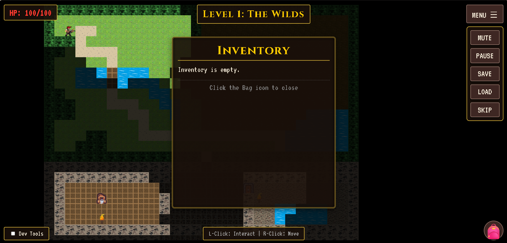

# 2D Web-Based Game Engine Framework+ Game Demo



A comprehensive, **fully modular** TypeScript-based 2D square grid game engine built with PixiJS. The engine features advanced algorithms for pathfinding, field of view calculation, fog of war, and room visibility management. 

This framework uses a **decoupled architecture** separating the reusable game engine core from application-specific game logic, making it highly flexible and suitable for various 2D game projects.

## Features

### Core Rendering
- **Multi-layered Map System**: Support for multiple rendering layers (terrain, entities, effects)
- **PixiJS Integration**: WebGL/Canvas-based rendering optimized for performance
- **Dynamic Camera/View Management**: Automatic viewport centering and boundary management
- **Grid-based Rendering**: 32x32 pixel tiles with customizable colors and styling

### Advanced Algorithms
- **A* Pathfinding**: Optimal path calculation with terrain cost consideration
  - Supports different terrain types (grass, swamp, road, water, etc.)
  - Considers walkability and movement costs
  
- **Dynamic Field of View (FOV)**
  - Ray-casting based visibility calculation
  - Shadow casting from obstacles
  - Support for multiple light sources
  
- **Fog of War System**
  - Three visibility states: Unknown, Explored, Visible
  - Dynamic exploration tracking
  - Greyed-out exploration memory
  
- **Room Visibility (Flood Fill)**
  - Identify connected rooms
  - Determine visible rooms from openings
  - Check if positions are in the same room

### User Interaction
- **Mouse Controls**
  - Left click: Select target/interact
  - Right click: Move character
  - Real-time coordinate tracking
  
- **Grid Coordinate Conversion**: Seamless conversion between screen and world coordinates

## Architecture Overview

### Modular Design Philosophy

This framework is built on a **separation of concerns** principle:

#### **GameEngine.ts** - Pure Reusable Framework
The core engine handles all low-level systems and can be used in ANY 2D game project:
- ✅ **Rendering** - PixiJS sprite management and camera control
- ✅ **Pathfinding** - A* algorithm for optimal NPC/player movement
- ✅ **Visibility Systems** - FOV, Fog of War, and room detection
- ✅ **Input Handling** - Mouse and keyboard event processing
- ✅ **Particle System** - Generic particle effects
- ✅ **Save/Load** - Persistent game state management
- ✅ **AI System** - NPC movement and behavior framework
- ✅ **Animation System** - Sprite animation framework

#### **GameApp.ts** - Game-Specific Application Layer
Handles all game-specific logic and can be customized for different games:
- 📊 **Player Stats** - Health, attack power, experience
- 🎮 **Game Mechanics** - Combat system, item interactions, door/chest logic
- 🗺️ **Level Management** - Level progression, map transitions
- 🔊 **Audio Management** - BGM, sound effects
- 📍 **Asset Management** - Sprite and texture loading
- 📜 **Dialogue System** - NPC conversations and UI messages

#### **main.ts** - Entry Point
Lightweight initialization that wires together GameApp and the DOM.

### Why This Architecture?

**Before**: Everything was hardcoded in GameEngine.ts
- ❌ Engine tightly coupled to specific game
- ❌ Difficult to reuse engine for other projects
- ❌ Hard to test individual systems
- ❌ Mixing engine logic with game logic

**After**: Clean separation of concerns
- ✅ Engine is completely reusable and game-agnostic
- ✅ Easy to plug-and-play different games with same engine
- ✅ Each system can be tested independently
- ✅ Clear interfaces and responsibilities
- ✅ GameApp can be easily forked for different game mechanics

### Real-World Usage Example

```typescript
// Using the SAME engine for a different game
import { GameEngine } from './engine/GameEngine';

// Create your own game app
class DifferentGameApp {
  private engine: GameEngine;
  
  constructor() {
    this.engine = new GameEngine();
    this.engine.setInteractionHandler(this.handleInteract.bind(this));
  }
  
  async init(canvas, width, height) {
    // Load YOUR game's assets
    await this.engine.init(canvas, width, height);
    // Load YOUR game's logic
    // YOUR game's progression system
  }
  
  private handleInteract(target) {
    // YOUR game's interaction logic
  }
}
```

## Project Structure

```
src/
├── engine/                     # ⭐ PURE REUSABLE FRAMEWORK (No game-specific code)
│   ├── GameEngine.ts          # Core engine orchestrator
│   ├── core/
│   │   ├── Vector.ts          # 2D vector math utilities
│   │   ├── Grid.ts            # Grid management and cell types
│   │   ├── MapObject.ts       # Generic map objects (enemies, NPCs, items)
│   │   ├── Inventory.ts       # Generic inventory system
│   │   └── Item.ts            # Generic item definitions
│   ├── algorithms/
│   │   ├── AStar.ts           # A* pathfinding algorithm
│   │   ├── FieldOfView.ts     # FOV calculation with shadows
│   │   ├── FloodFill.ts       # Room visibility algorithm
│   │   ├── FogOfWar.ts        # Fog of war tracking system
│   │   └── NPCAISystem.ts     # NPC AI behavior
│   ├── map/
│   │   └── MapLayer.ts        # Multi-layer map definitions and loading
│   ├── render/
│   │   ├── Renderer.ts        # PixiJS renderer and camera system
│   │   ├── Animation.ts       # Animation framework
│   │   └── Particles.ts       # Particle system
│   ├── interaction/
│   │   ├── MouseHandler.ts    # Mouse event handling
│   │   └── KeyboardHandler.ts # Keyboard event handling
│   ├── editor/
│   │   └── LevelEditor.ts     # Level editor utilities
│   └── system/
│       ├── UIManager.ts       # UI management
│       ├── AudioManager.ts    # Audio system
│       ├── SaveLoadManager.ts # Save/load game state
│       ├── InteractionManager.ts # Interaction system
│       ├── PlayerManager.ts   # Player management
│       ├── DialogueManager.ts # Dialogue system
│       └── TileRegistry.ts    # Tile definitions
│
├── GameApp.ts                 # 🎮 GAME-SPECIFIC APPLICATION LAYER
│                              # Handles game mechanics, player stats, interactions
├── main.ts                    # Application entry point
├── styles/
│   └── main.scss              # Game UI styling
└── counter.ts                 # Legacy utility

public/
├── maps/
│   ├── dungeon_adventure.json # Main level map
│   └── level2.json            # Second level
├── assets/
│   ├── hero.png               # Player sprite
│   ├── goblin.png             # Enemy sprite
│   ├── potion.png             # Item sprites
│   └── ...
└── audio/
    └── bgm.mp3                # Background music
```

### File Responsibilities

| File | Responsibility | Reusable? |
|------|-----------------|-----------|
| `GameEngine.ts` | Core framework, rendering, systems | ✅ Yes |
| `GameApp.ts` | Game logic, player stats, interactions | ❌ Game-specific |
| `main.ts` | Initialization, wiring | ✅ Mostly (needs GameApp reference) |
| `engine/*` | All engine systems | ✅ Yes |

## Map JSON Format

Maps are defined in JSON with multiple layers:

```json
{
  "name": "Map Name",
  "width": 40,
  "height": 30,
  "layers": [
    {
      "name": "terrain",
      "data": [[1, 2, 3, ...], ...]
    },
    {
      "name": "collision",
      "data": [[0, 1, 0, ...], ...]
    }
  ]
}
```

### Tile Types
- `0`: Empty/Walkable (grass)
- `1`: Wall/Obstacle
- `2`: Grass
- `3`: Swamp (high movement cost)
- `4`: Road (low movement cost)
- `5`: Water (non-walkable)

## Installation & Setup

### Prerequisites
- Node.js 16+
- npm or yarn

### Development

1. Install dependencies:
```bash
npm install
```

2. Start development server:
```bash
npm run dev
```

3. Open your browser to `http://localhost:5173`

### Building for Production

```bash
npm run build
```

The output will be in the `dist/` directory.

## Usage

### Basic Game Engine Usage

```typescript
import { GameEngine } from './engine/GameEngine';

const canvas = document.getElementById('gameCanvas') as HTMLCanvasElement;
const engine = new GameEngine();

// Initialize engine (no game-specific code)
await engine.init(canvas, 1280, 720);

// Set custom interaction handler
engine.setInteractionHandler((targetObject) => {
  if (!targetObject) return;
  console.log('Interacted with:', targetObject.id);
});

// Load a map
await engine.loadMap('/maps/test-map.json');

// Position the player
engine.setPlayerPosition(new Vector(10, 10));
```

### Using GameApp (Game-Specific Wrapper)

```typescript
import { GameApp } from './GameApp';

const gameApp = new GameApp();
const canvas = document.getElementById('gameCanvas') as HTMLCanvasElement;

// Initialize with all game logic
await gameApp.init(canvas, 1280, 720);

// GameApp handles:
// - Asset loading
// - Player stats (health, attack)
// - Game mechanics (combat, items)
// - Level progression
```

### Creating a Different Game with Same Engine

```typescript
// Create a puzzle game using the same engine
class PuzzleGame {
  private engine: GameEngine;
  private puzzleState: PuzzleState;
  
  constructor() {
    this.engine = new GameEngine();
    this.puzzleState = new PuzzleState();
    this.engine.setInteractionHandler(this.onTilePush.bind(this));
  }
  
  async init(canvas, width, height) {
    await this.engine.init(canvas, width, height);
    await this.engine.loadMap('/maps/puzzle-level.json');
  }
  
  private onTilePush(target: MapObject | null) {
    // Completely different game logic!
    if (!target) return;
    this.puzzleState.pushTile(target.position);
    if (this.puzzleState.isSolved()) {
      this.advanceLevel();
    }
  }
}
```

### Using Pathfinding

```typescript
import { AStarPathfinder } from './engine/algorithms/AStar';
import { Vector } from './engine/core/Vector';

const pathfinder = new AStarPathfinder(grid);
const path = pathfinder.findPath(start, goal);
// Returns: Vector[] - sequence of cells to traverse
```

### Calculating Field of View

```typescript
import { FieldOfView } from './engine/algorithms/FieldOfView';

const fov = new FieldOfView(grid);
const visibleCells = fov.calculateFOV(playerPosition, 10); // radius 10
// Returns: Set<string> - visible cell coordinates
```

### Fog of War Tracking

```typescript
import { FogOfWar } from './engine/algorithms/FogOfWar';

const fogOfWar = new FogOfWar(mapWidth, mapHeight, fov);
fogOfWar.updateFromFOV(visibleCells);

const state = fogOfWar.getFogState(x, y); 
// Returns: 'UNKNOWN' | 'EXPLORED' | 'VISIBLE'
```

## Data Flow Architecture

### Rendering Pipeline
```
User Input (Mouse/Keyboard)
    ↓
MouseHandler / KeyboardHandler
    ↓
GameApp.onInteract() [Game Logic]
    ↓
GameEngine (Core Systems)
    - Pathfinding
    - FOV / Fog of War
    - Particle Effects
    - Animation
    ↓
Renderer (PixiJS)
    ↓
Screen Output
```

### Separation of Concerns

**GameEngine handles:**
- What can move? (Grid, Pathfinding)
- What can see? (FOV, Fog of War)
- How to render? (Renderer, Sprites)
- When to render? (Main loop)

**GameApp handles:**
- WHO moves? (Player, NPCs with game logic)
- WHY do they move? (Quest, combat, AI behavior)
- WHAT happens on interaction? (Combat, dialogue, item pickup)
- HOW do game mechanics work? (Player stats, progression, balance)

## Game-Specific Customization

### Extending GameApp

```typescript
// Customize for your game
export class MyGame extends GameApp {
  private questSystem: QuestSystem;
  private skillSystem: SkillSystem;
  
  async loadLevel(level: number) {
    // Your custom level loading logic
    await super.loadLevel(level);
    this.questSystem.startLevelQuests();
  }
  
  private onInteract(targetObject: MapObject | null) {
    // Your custom interaction logic
    super.onInteract(targetObject);
    this.questSystem.trackInteraction(targetObject);
  }
}
```

### Adding Engine Features

```typescript
// Extend GameEngine without changing game logic
// GameEngine is pure framework -> add features safely

class EnhancedGameEngine extends GameEngine {
  // Add new systems
  private weatherSystem: WeatherSystem;
  private timeSystem: TimeSystem;
  
  // Override update without breaking existing code
  protected update(deltaTime: number) {
    super.update(deltaTime);
    this.weatherSystem.update(deltaTime);
    this.timeSystem.update(deltaTime);
  }
}
```

## Demo Features

The included demo demonstrates:
- ✅ Multi-layered map rendering
- ✅ Dynamic field of view calculation
- ✅ Fog of war with exploration memory
- ✅ A* pathfinding with terrain costs
- ✅ Real-time player interaction
- ✅ Camera following player
- ✅ Mouse-based grid coordinate system
- ✅ Responsive UI with coordinate display
- ✅ Basic Combat System: Player attacks enemies, enemies retaliate, health updates, and game over condition.
- ✅ Weapon Damage Bonus: Player deals increased damage when equipped with a weapon.
- ✅ Consumable Items: Potions can be used to restore player health.
- ✅ Dynamic Level Loading: Transitions between different maps (e.g., Level 1 to Level 2).
- ✅ Dynamic Map Name Display: The UI now shows the actual name of the loaded map.
- ✅ Mute/Unmute Audio: Toggle background music on and off.

## Controls

| Action | Effect |
|--------|--------|
| Left Click | Select target cell (shows pathfinding visualization) / Interact with objects (e.g., pick up items, open chests, attack enemies) |
| Right Click | Move player to clicked cell |
| Mouse Move | Updates coordinate display |
| Mute Button | Toggles background music on/off |
| Pause Button | Pauses/Resumes the game |
| Save Button | Saves the current game state |
| Load Button | Loads the last saved game state |
| Skip Button | Skips current dialogue |

## Architecture Highlights

### ✨ Modular Framework Design

The core principle: **Engine is completely decoupled from game logic**

```
┌─────────────────────────────────────────────────────┐
│            YOUR GAME APPLICATION (GameApp)          │
│  Player Stats │ Combat │ Dialogue │ Progression     │
└──────────────────┬──────────────────────────────────┘
                   │ setInteractionHandler()
                   ↓
┌─────────────────────────────────────────────────────┐
│         REUSABLE GAME ENGINE (GameEngine)           │
│ Rendering │ Pathfinding │ FOV │ Audio │ Save/Load   │
└─────────────────────────────────────────────────────┘
                   ↓
┌─────────────────────────────────────────────────────┐
│              CORE SYSTEMS (engine/*)                │
│  Grid │ Algorithms │ Renderer │ Input │ Particles   │
└─────────────────────────────────────────────────────┘
```

### Separation of Concerns

- **Grid System**: Handles grid data and walkability
- **Algorithms**: Pure logic for pathfinding, visibility, etc.
- **Renderer**: PixiJS rendering abstraction (can be replaced)
- **Interaction**: Input handling and event dispatch
- **GameEngine**: Orchestrates all systems (no game logic)
- **GameApp**: All game-specific mechanics (uses engine)

### Performance Optimizations
- PixiJS WebGL rendering for efficient sprite management
- Heuristic-based A* for faster pathfinding
- Efficient FOV ray-casting with shadow casting
- Cell-based flood fill for room detection
- Cached visibility calculations
- Lazy evaluation of off-screen objects

### Extensibility

The modular design enables:
- ✅ **Plug-and-Play Games**: Use same engine for different game types
- ✅ **Pluggable Renderer**: Swap PixiJS with Babylon.js, Threejs, Canvas2D, etc.
- ✅ **Custom Systems**: Add weather, time, economy, faction systems without touching engine
- ✅ **Easy Testing**: Test game logic independent of engine
- ✅ **Asset Flexibility**: Customize tile colors, sprites, and properties
- ✅ **Scalable**: Support for arbitrary number of map layers and grid sizes

## Technologies Used

- **TypeScript**: Type-safe game logic
- **PixiJS 8.x**: High-performance 2D rendering
- **Vite**: Fast build tool and dev server
- **SCSS**: Styled component styling
- **HTML5 Canvas**: Core rendering target

## Future Enhancements

- [ ] Animated sprites and effects
- [ ] Multiple light sources with distance falloff
- [ ] Dynamic pathfinding weights based on FOV
- [ ] Tile-based animation system
- [ ] More sophisticated particle effects
- [ ] Multiplayer support with networking
- [ ] Mobile touch controls
- [ ] Enhanced asset loader with caching
- [ ] Advanced inventory and equipment system
- [ ] Improved NPC AI and behavior trees

## Recent Major Changes (v2.0 - Modularization)

### What Changed?

**Before**: Monolithic GameEngine with all game logic hardcoded
- ❌ Asset lists hardcoded in engine
- ❌ Player stats in engine
- ❌ Combat logic in engine
- ❌ Level progression in engine
- ❌ Interaction handlers in engine

**After**: Clean separation with GameApp layer
- ✅ Engine is pure framework (no game logic)
- ✅ GameApp handles all game mechanics
- ✅ Easy to create new games or modify existing one
- ✅ Engine reusable for ANY 2D grid-based game

### Migration Summary

| Moved From GameEngine.ts to GameApp.ts |
|----------------------------------------|
| Player health, maxHealth, attackPower |
| Asset loading list |
| Level management (levelMap, etc.) |
| Combat system logic |
| Interaction handlers (combat, items, doors, chests) |
| Player stat management |
| UI callbacks (pause, mute, etc.) |

### No Breaking Changes for Core Engine

All engine systems remain the same:
- Pathfinding API: `findPath(start, goal)`
- FOV API: `calculateFOV(position, radius)`
- Fog of War API: `updateFromFOV(visibleCells)`
- Rendering API: `renderMap(map), updateSpritePosition()`
- Input API: `on(eventType, callback)`

### How to Migrate Existing Code

```typescript
// Old approach (mixed engine + game logic)
const engine = new GameEngine();
await engine.init(canvas, width, height);
// engine had playerHealth, combat, etc.

// New approach (separated concerns)
const gameApp = new GameApp();
await gameApp.init(canvas, width, height);
const engine = gameApp.getEngine();
// gameApp has playerHealth, combat, etc.
```

## License

This project is provided as-is for educational and development purposes.

## Contributing

This is a framework designed for game development projects. Feel free to extend and customize it for your needs!

---

For more information and updates, visit the project repository.
